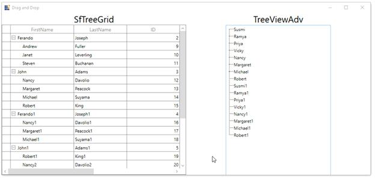

# How to Drag and Drop Rows between WPF TreeGrid and WPF TreeViewAdv?

This example illustrates how to drag and drop rows in between [WPF TreeGrid](https://www.syncfusion.com/wpf-controls/treegrid) (SfTreeGrid) and [WPF TreeViewAdv](https://help.syncfusion.com/wpf/classic/treeview/overview).

You can drag and drop the items between TreeViewAdv and TreeGrid by wiring the [Drop](https://help.syncfusion.com/cr/wpf/Syncfusion.UI.Xaml.TreeGrid.TreeGridRowDragDropController.html#Syncfusion_UI_Xaml_TreeGrid_TreeGridRowDragDropController_Drop) and [DragStart](https://help.syncfusion.com/cr/wpf/Syncfusion.UI.Xaml.TreeGrid.TreeGridRowDragDropController.html#Syncfusion_UI_Xaml_TreeGrid_TreeGridRowDragDropController_DragStart) events from the [TreeGridRowDragDropController](https://help.syncfusion.com/cr/wpf/Syncfusion.UI.Xaml.TreeGrid.TreeGridRowDragDropController.html) class.

``` c#
private void RowDragDropController_DragStart(object sender, TreeGridRowDragStartEventArgs e)
{
    e.Handled = true;
    var dataObject = new DataObject();
    dataObject.SetData("SourceTreeGrid", this.AssociatedObject.sfTreeGrid);
    dataObject.SetData("Nodes", e.DraggingNodes);
            
    foreach (var node in e.DraggingNodes)
    {
        if (node.HasChildNodes)
        {
            records.Add(node.Item as EmployeeInfo);
            GetChildNodes(node);
        }
        else
        {
            records.Add(node.Item as EmployeeInfo);
        }
    }

    dataObject.SetData(records);

    if(records!=null)
    DragDrop.DoDragDrop(this.AssociatedObject.sfTreeGrid, dataObject, DragDropEffects.Copy | DragDropEffects.Move);
    records.Clear();
}

private void RowDragDropController_Drop(object sender, TreeGridRowDropEventArgs e)
{
    if (e.IsFromOutSideSource)
    {
        ObservableCollection<object> item = e.Data.GetData(typeof(ObservableCollection<object>)) as ObservableCollection<object>;
        var record = item[0] as EmployeeInfo;
        var dropPosition = e.DropPosition.ToString();
        var newItem = new EmployeeInfo();

        var rowIndex = AssociatedObject.sfTreeGrid.ResolveToRowIndex(e.TargetNode.Item);
        int nodeIndex = (int)rowIndex;
        if (dropPosition != "None" && rowIndex != -1)
        {
            if (AssociatedObject.sfTreeGrid.View is TreeGridSelfRelationalView)
            {
                var treeNode = AssociatedObject.sfTreeGrid.GetNodeAtRowIndex(rowIndex);

                if (treeNode == null)
                    return;

                var data = treeNode.Item;
                AssociatedObject.sfTreeGrid.SelectionController.SuspendUpdates();
                var itemIndex = -1;

                TreeNode parentNode = null;

                if (dropPosition == "DropBelow" || dropPosition == "DropAbove")
                {
                    parentNode = treeNode.ParentNode;

                    if (parentNode == null)
                        newItem = new EmployeeInfo() { FirstName = record.FirstName, LastName = record.LastName, ID = record.ID, Salary = record.Salary, Title = record.Title, ReportsTo = -1 };
                    else
                    {
                        var parent = parentNode.Item as EmployeeInfo;
                        newItem = new EmployeeInfo() { FirstName = record.FirstName, LastName = record.LastName, ID = record.ID, Salary = record.Salary, Title = record.Title, ReportsTo = parent.ID };
                    }
                }
                else if (dropPosition == "DropAsChild")
                {
                    if (!treeNode.IsExpanded)
                        AssociatedObject.sfTreeGrid.ExpandNode(treeNode);

                    parentNode = treeNode;
                    var parent = parentNode.Item as EmployeeInfo;
                    newItem = new EmployeeInfo() { FirstName = record.FirstName, LastName = record.LastName, ID = record.ID, Salary = record.Salary, Title = record.Title, ReportsTo = parent.ID };

                }
                IList sourceCollection = null;

                if (dropPosition == "DropBelow" || dropPosition == "DropAbove")
                {
                    if (treeNode.ParentNode != null)
                    {
                        var collection = AssociatedObject.sfTreeGrid.View.GetPropertyAccessProvider().GetValue(treeNode.ParentNode.Item, AssociatedObject.sfTreeGrid.ChildPropertyName) as IEnumerable;
                        sourceCollection = GetSourceListCollection(collection);
                    }
                    else
                    {
                        sourceCollection = GetSourceListCollection(AssociatedObject.sfTreeGrid.View.SourceCollection);
                    }
                    itemIndex = sourceCollection.IndexOf(data);

                    if (dropPosition == "DropBelow")
                    {
                        itemIndex += 1;
                    }
                }
                else if (dropPosition == "DropAsChild")
                {
                    var collection = AssociatedObject.sfTreeGrid.View.GetPropertyAccessProvider().GetValue(data, AssociatedObject.sfTreeGrid.ChildPropertyName) as IEnumerable;

                    sourceCollection = GetSourceListCollection(collection);

                    if (sourceCollection == null)
                    {
                        var list = data.GetType().GetProperty(AssociatedObject.sfTreeGrid.ChildPropertyName).PropertyType.CreateNew() as IList;

                        if (list != null)
                        {
                            AssociatedObject.sfTreeGrid.View.GetPropertyAccessProvider().SetValue(treeNode.Item, AssociatedObject.sfTreeGrid.ChildPropertyName, list);
                            sourceCollection = list;
                        }
                    }
                    itemIndex = sourceCollection.Count;
                }
                sourceCollection.Insert(itemIndex, newItem);
                AssociatedObject.sfTreeGrid.SelectionController.ResumeUpdates();
                (AssociatedObject.sfTreeGrid.SelectionController as TreeGridRowSelectionController).RefreshSelection();
                e.Handled = true;
            }
        }
        (AssociatedObject.treeview.ItemsSource as ObservableCollection<EmployeeInfo>).Remove(record as EmployeeInfo);
    }
}
```

In TreeViewAdv, you need to wire the Drop event,

``` c#
private void Treeview_Drop(object sender, DragEventArgs e)
{
    ObservableCollection<TreeNode> treeNodes = new ObservableCollection<TreeNode>();

    if (e.Data.GetDataPresent("Nodes"))
        treeNodes = e.Data.GetData("Nodes") as ObservableCollection<TreeNode>;

    EmployeeInfo item = new EmployeeInfo();

    if (treeNodes.Count == 0 || treeNodes == null)
        return;

    foreach (var node in treeNodes)
    {
        (AssociatedObject.sfTreeGrid.ItemsSource as ObservableCollection<EmployeeInfo>).Remove(node.Item as EmployeeInfo);
    }
}
```


